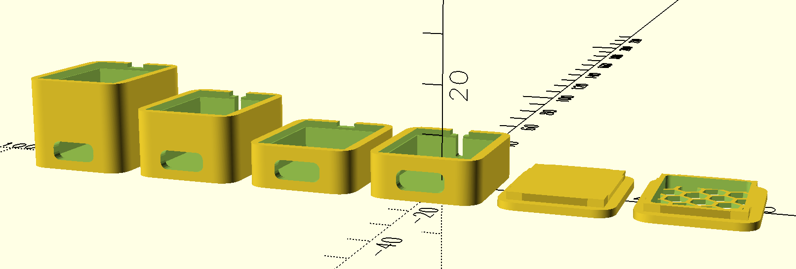

# ESP32 C3 Super Mini Case
A basic case for ESP32 C3 Super Mini boards. Lid clicks in place quite firmly. With optional pass-through for wires.

Created using OpenSCAD, using BOSL2 and hex-grid libraries. Variable size cases can be generated using SCAD source.

Find the STL online:
https://www.printables.com/model/1137008-esp32-c3-super-mini-case 
